# Developer Guide

## Acknowledgements

- SE-EDU AddressBook Level-3 architecture concepts: https://se-education.org/addressbook-level3/
- CS2113 project conventions and tooling tutorials: https://se-education.org/

## Product Scope

### Target user profile

CG2StocksTracker targets typing-oriented amateur investors who want a fast command-line workflow to manage personal investment holdings.

Typical user characteristics:

- comfortable with terminal/CLI interaction
- wants lightweight tracking without spreadsheet maintenance
- tracks stocks, ETFs, and bonds in one place
- needs quick portfolio snapshots and simple performance views

### Value proposition

Make informed investment decisions with clarity and confidence.

CG2StocksTracker helps amateur investors understand the real, current value of their assets and anticipate future market trends using clear analysis and actionable insights.

CG2StocksTracker helps typing-oriented amateur investors maintain a clear, accurate view of their personal investment holdings through a command-line interface, enabling quick portfolio reviews and basic analysis without the complexity of spreadsheets or heavyweight trading platforms.

## Design

### Architecture

The application follows a layered command pipeline:

1. `Ui` reads command text and displays responses.
2. `Parser` converts raw input to `ParsedCommand`.
3. `CG2StocksTracker` dispatches execution by `CommandType`.
4. Model classes (`PortfolioBook`, `Portfolio`, `Holding`, `Watchlist`) perform business logic.
5. `Storage` persists state after successful state-changing operations.

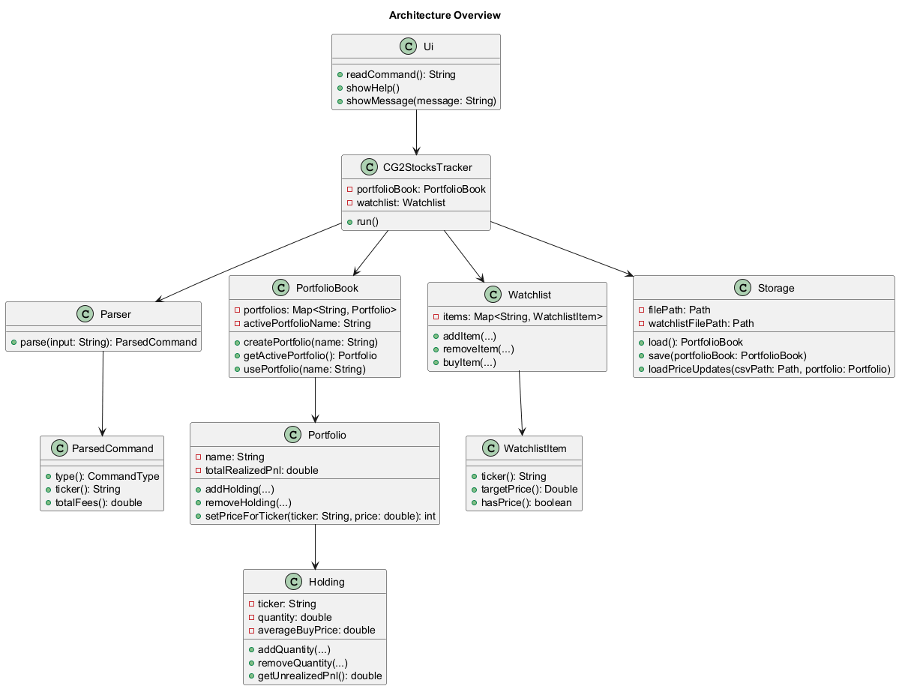

### Core class responsibilities

- `CG2StocksTracker`: application coordinator and command dispatcher.
- `Parser`: command syntax validation and typed command construction.
- `ParsedCommand`: immutable command DTO with optional fields and fee aggregation.
- `PortfolioBook`: multi-portfolio registry and active-portfolio context.
- `Portfolio`: holding lifecycle, valuation, and realized/unrealized P&L aggregation.
- `Holding`: quantity, cost basis, last price, and per-holding P&L logic.
- `Watchlist`: watch candidates and buy-into-portfolio operation.
- `Storage`: persistence of portfolios/watchlist and CSV price import for `/setmany`.
- `Ui`: user-facing formatting for command outputs and errors.

## Command Features

## `/create` - Create Portfolio

### High-level design

Creates a new named portfolio in `PortfolioBook`. If no active portfolio exists, the created portfolio becomes active.

### Component-level implementation

- Parsing: `Parser.parseCreate(...)` validates name presence.
- Execution: `CG2StocksTracker.handleCreate(...)` calls `portfolioBook.createPortfolio(name)`.
- Persistence: state is saved via `save()`.

### Class responsibilities

- `Parser`: enforces `/create NAME` format.
- `PortfolioBook`: enforces uniqueness and first-active behavior.
- `Ui`: shows created and active portfolio messages.

### Command execution flow

1. Parse input into `ParsedCommand(type=CREATE, name=...)`.
2. Create portfolio in model.
3. Persist updated state.
4. Print success output.

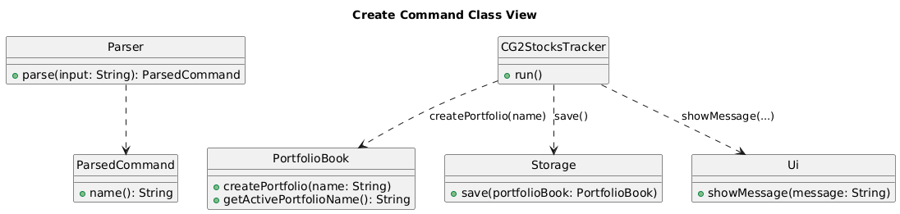
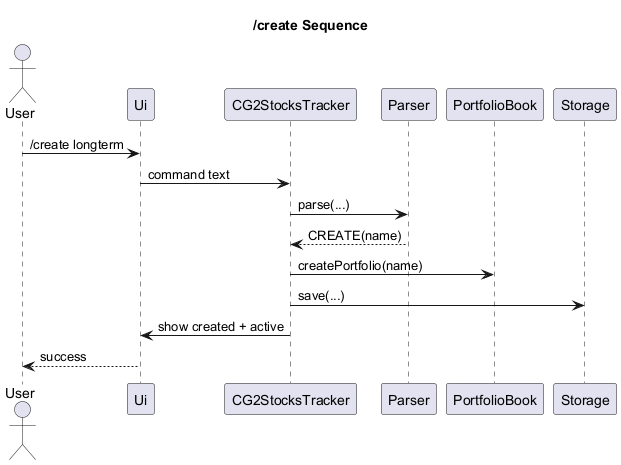

### Error handling and validation

- Missing name -> parser usage error.
- Duplicate name -> `AppException` from `PortfolioBook`.

### Alternatives considered

- Auto-generate portfolio IDs instead of user-provided names.
- Rejected: names are meaningful for CLI workflows and easier to remember.

### Current limitations

- No rename command for existing portfolios.

### Possible future improvements

- Add `/rename` for portfolio names.

## `/use` - Switch Active Portfolio

### High-level design

Sets active portfolio context used by most holdings commands.

### Component-level implementation

- Parsing: `Parser.parseUse(...)`.
- Execution: `CG2StocksTracker.handleUse(...)` -> `portfolioBook.usePortfolio(name)`.
- Persistence: state is saved via `save()`.

### Class responsibilities

- `PortfolioBook`: validates target existence and stores active name.
- `Ui`: confirms active portfolio.

### Command execution flow

1. Parse `/use NAME`.
2. Validate portfolio exists.
3. Set active context.
4. Persist updated state.
5. Return confirmation.

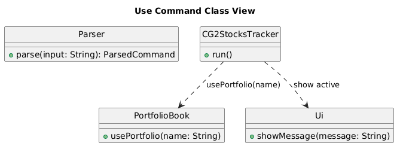
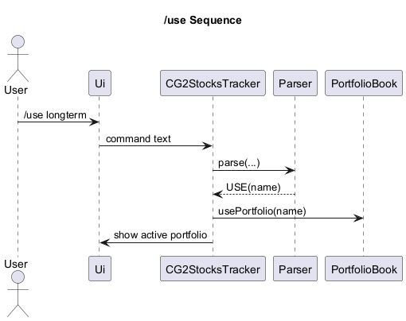

### Error handling and validation

- Missing name -> parser usage error.
- Unknown name -> `Portfolio not found`.

### Alternatives considered

- Implicitly create on `/use` miss.
- Rejected: hides typos and weakens explicit portfolio management.

### Current limitations

- No command to show only current active portfolio quickly.

### Possible future improvements

- Add `/active` command.

## `/list` - List Holdings or Portfolio Summaries

### High-level design

Supports both holdings listing and portfolio summary listing.

Supported variants:

- `/list`
- `/list --stock`
- `/list --etf`
- `/list --bond`
- `/list --portfolios`

### Component-level implementation

- Parsing: `Parser.parseList(...)` restricts allowed targets.
- Execution: `CG2StocksTracker.handleList(...)` branches on `listTarget`.
- Rendering: `Ui.showHoldings(...)`, `Ui.showPortfolioSummaries(...)`, `Ui.showPortfolios(...)`.

### Class responsibilities

- `Parser`: validates argument count and target option.
- `CG2StocksTracker`: determines variant behavior.
- `Ui`: formats output list and totals.

### Command execution flow

1. Parse list target or empty target.
2. Route by variant:
   - `--portfolios` -> portfolio summary view.
   - type filter -> filtered holdings.
   - default -> holdings for active portfolio, or portfolio names if none active.

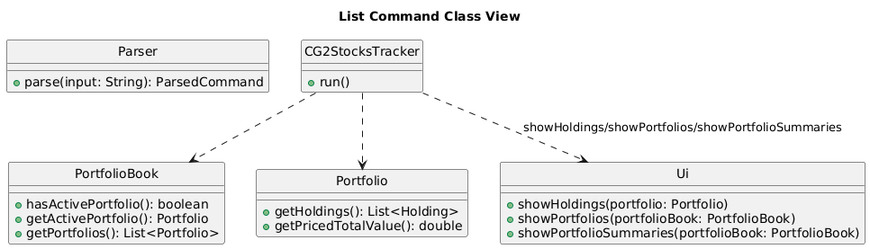
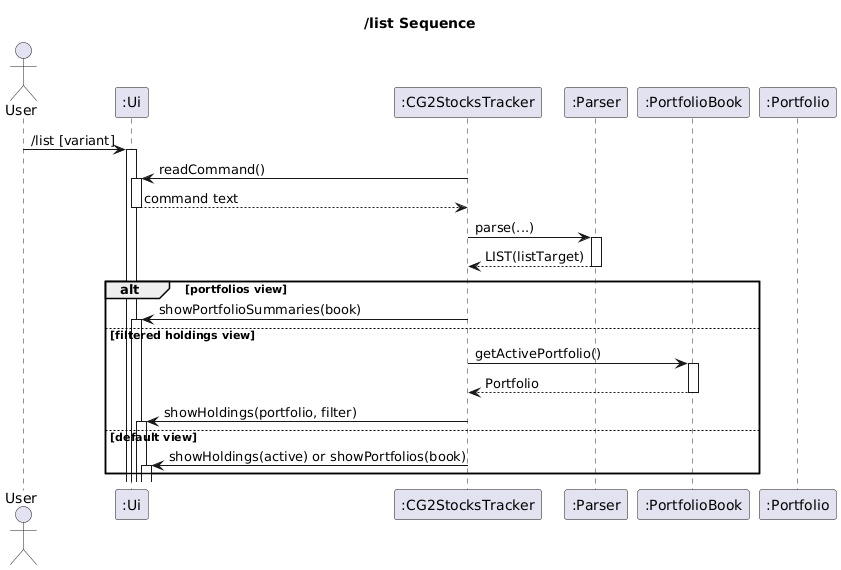

### Error handling and validation

- Unsupported option -> usage error.
- Active portfolio required for filtered holdings -> model exception.

### Alternatives considered

- Separate commands (`/listholdings`, `/listportfolios`).
- Rejected: one command with variants is simpler for users.

### Current limitations

- No paging/sorting options in holdings list.

### Possible future improvements

- Add sorting and pagination flags.

## `/add` - Add Holding

### High-level design

Adds units to an existing holding or creates a new holding in active portfolio.

### Component-level implementation

- Parsing: `Parser.parseAdd(...)` validates required options and optional fees.
- Execution: `CG2StocksTracker.handleAdd(...)` -> `Portfolio.addHolding(...)`.
- Cost basis: `Holding.addQuantity(...)` computes weighted average with fees.

### Class responsibilities

- `Parser`: validates option keys and numeric constraints.
- `Portfolio`: manages holding map and add behavior.
- `Holding`: stores quantity, average buy price, and market price.

### Command execution flow

1. Parse type/ticker/qty/price and fee fields.
2. Aggregate fees using `ParsedCommand.totalFees()`.
3. Add to active portfolio.
4. Save state.
5. Show added/updated output.

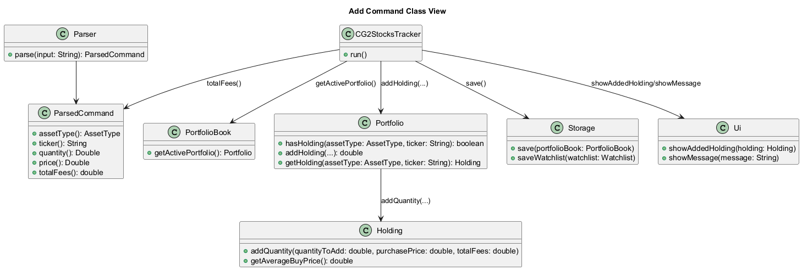
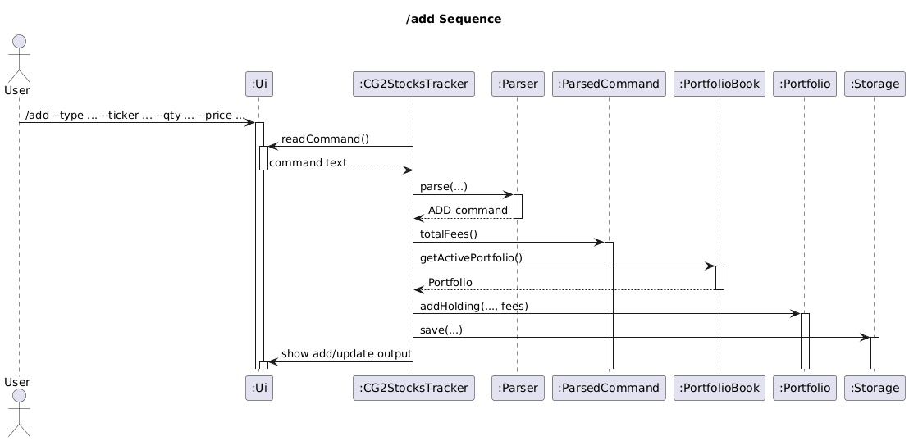

### Error handling and validation

- Missing required options -> parser error.
- Ticker exceeds 10 characters -> parser error.
- Invalid type/qty/price/fees -> parser or model error.
- No active portfolio -> execution error.

### Alternatives considered

- Store each buy as separate transaction instead of aggregate holding.
- Rejected: increases complexity for current project scope.

### Current limitations

- No transaction history view; only aggregate holding state is retained.

### Possible future improvements

- Add transaction ledger model and `/trades` command.

## `/remove` - Remove Holding Units

### High-level design

Sells part or all of a holding and records realized P&L.

### Component-level implementation

- Parsing: `Parser.parseRemove(...)` validates options.
- Execution: `CG2StocksTracker.handleRemove(...)` -> `Portfolio.removeHolding(...)`.
- Realized P&L: `Holding.removeQuantity(...)` computes delta using average buy price and fees.

### Class responsibilities

- `Portfolio`: chooses effective sell price and updates cumulative realized P&L.
- `Holding`: adjusts quantity and computes realized delta.
- `Ui`: prints sold quantity, sell price, fees, and realized P&L.

### Command execution flow

1. Parse optional quantity/price/fees.
2. Resolve quantity (specific or full).
3. Resolve sell price (`--price` or saved `lastPrice`).
4. Remove quantity and compute realized delta.
5. Remove holding if quantity reaches zero.
6. Save state and print result.

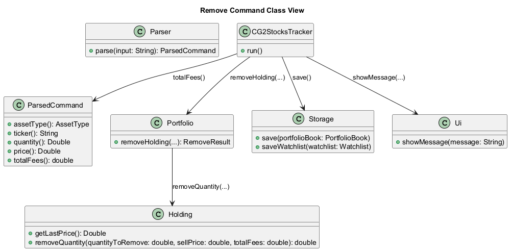
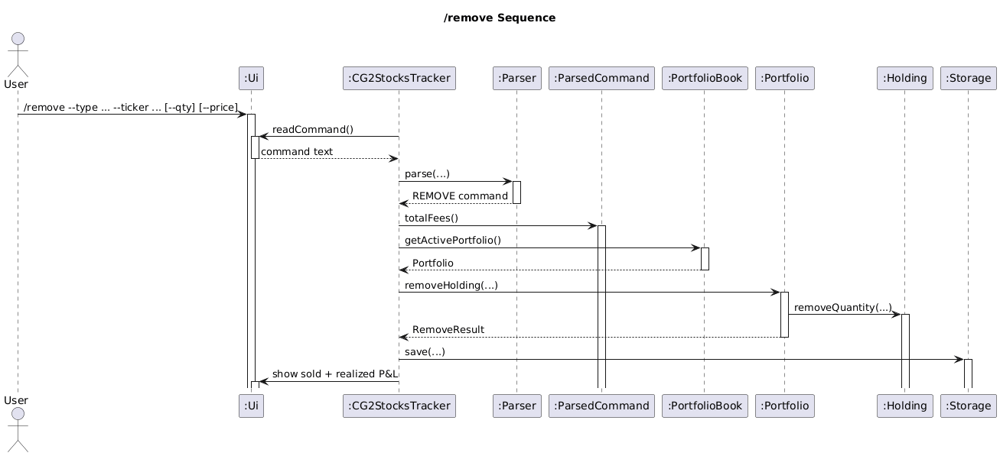

### Error handling and validation

- Holding not found.
- Invalid quantity to remove.
- Price missing when no saved last price exists.
- Ticker must not exceed 10 characters.

### Alternatives considered

- Require explicit `--price` always.
- Rejected: reduces usability when prices were already set.

### Current limitations

- No tax-lot methods (FIFO/LIFO/specific lot); uses average cost.

### Possible future improvements

- Add selectable tax-lot accounting modes.

## `/set` - Set Market Price

### High-level design

Updates last known prices used for valuation and remove fallback pricing.

Variants:

- typed update: `/set --type TYPE --ticker TICKER --price PRICE`
- ticker-wide update: `/set --ticker TICKER --price PRICE`

### Component-level implementation

- Parsing: `Parser.parseSet(...)` with optional type.
- Execution: `CG2StocksTracker.handleSet(...)` routes to:
  - `Portfolio.setPriceForHolding(...)` for typed mode
  - `Portfolio.setPriceForTicker(...)` for ticker-wide mode

### Class responsibilities

- `Portfolio`: applies price updates.
- `Ui`: confirms updates.

### Command execution flow

1. Parse ticker, price, optional type.
2. Branch by presence of type.
3. Apply update(s).
4. Save state.
5. Print confirmation.

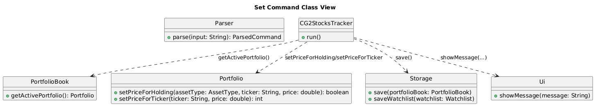
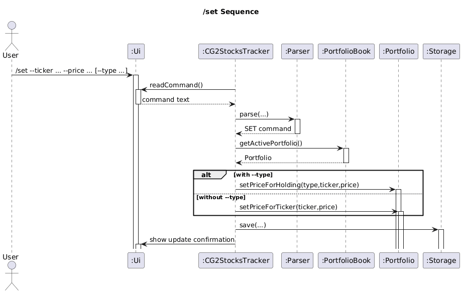

### Error handling and validation

- Price must be > 0.
- Ticker must not exceed 10 characters.
- Unknown target holding/ticker returns explicit error.

### Alternatives considered

- Only allow typed updates.
- Rejected: ticker-wide update is useful for bulk same-ticker updates across asset types.

### Current limitations

- No historical price series; only latest price is stored.

### Possible future improvements

- Add optional price timestamp/history support.

## `/watch` - Watchlist Operations

### High-level design

Maintains watchlist entries and supports buying one unit into a portfolio.

Variants:

- `/watch add --type TYPE --ticker TICKER [--price PRICE]`
- `/watch remove --type TYPE --ticker TICKER`
- `/watch list`
- `/watch buy --type TYPE --ticker TICKER --portfolio PORTFOLIO_NAME`

### Component-level implementation

- Parsing: `Parser.parseWatch(...)` and action-specific parsers.
- Execution: `CG2StocksTracker.handleWatch(...)` routes by action.
- Buy action: `Watchlist.buyItem(...)` validates price and portfolio, buys 1 unit, removes watch item.

### Class responsibilities

- `Watchlist`: source of truth for watch items and buy logic.
- `PortfolioBook`/`Portfolio`: target portfolio resolution and add operation.
- `Ui`: list and action output formatting.

### Command execution flow

1. Parse action and required options.
2. Dispatch to add/remove/list/buy handler.
3. Apply model mutation if action changes state.
4. Save state for mutating actions.

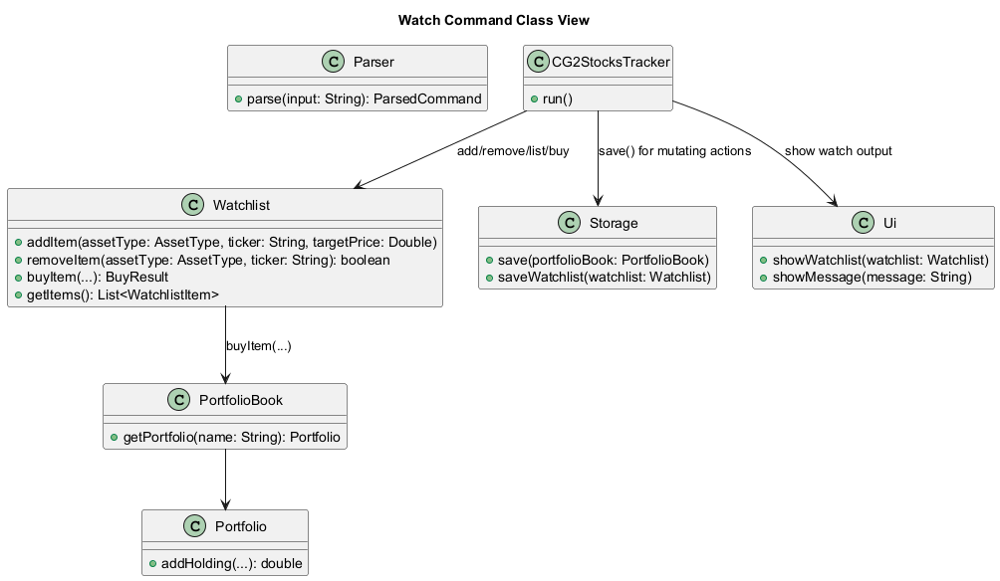
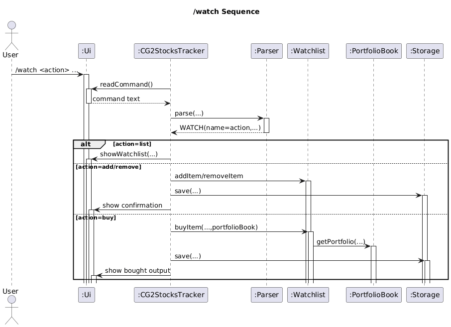

### Error handling and validation

- Duplicate add.
- Remove/buy target not found.
- Buy without watch price.
- Buy target portfolio not found.
- Ticker must not exceed 10 characters.

### Alternatives considered

- Allow configurable buy quantity for `/watch buy`.
- Rejected initially to keep command simple and predictable.

### Current limitations

- `/watch buy` always buys 1 unit.

### Possible future improvements

- Add optional `--qty` and optional fee fields to watch-buy flow.

## `/setmany` - Bulk CSV Price Update

### High-level design

Processes CSV rows and updates matching ticker prices in active portfolio.

### Component-level implementation

- Parsing: `Parser.parseSetMany(...)` captures file path.
- Execution: `CG2StocksTracker.handleSetMany(...)` -> `Storage.loadPriceUpdates(...)`.
- Result reporting: `Ui.showBulkUpdateResult(...)`.

### Class responsibilities

- `Storage`: file checks, CSV parsing, row-level validation, partial success handling.
- `Portfolio`: ticker-wide update application.

### Command execution flow

1. Parse file path.
2. Validate file exists and header is `ticker,price`.
3. Process each row independently.
4. Return success/failure summary.
5. Save state after processed updates.

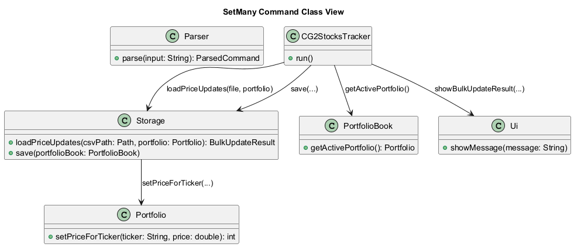
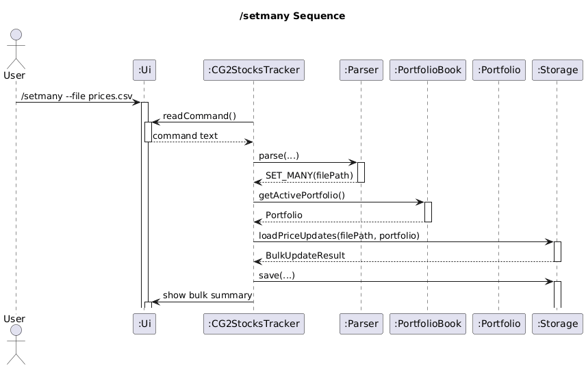

### Error handling and validation

- Empty CSV file.
- Invalid header.
- Invalid row shape, blank ticker, ticker longer than 10 characters, non-positive price.
- Holding not found for row ticker.

### Alternatives considered

- Stop on first invalid row.
- Rejected: partial success gives better operational usability.

### Current limitations

- CSV format fixed to `ticker,price`.

### Possible future improvements

- Support optional type column and customizable delimiters.

## `/value` - Portfolio Valuation

### High-level design

Provides value and P&L summary for active portfolio.

### Component-level implementation

- Parsing: no-argument command.
- Execution: `CG2StocksTracker.handleValue()` -> `Ui.showPortfolioValue(portfolio)`.
- Model values sourced from `Portfolio` and `Holding` state.

### Class responsibilities

- `Portfolio`: current total value, total realized/unrealized P&L.
- `Ui`: row-level and summary rendering.

### Command execution flow

1. Resolve active portfolio.
2. Compute and display totals and per-holding unrealized P&L.

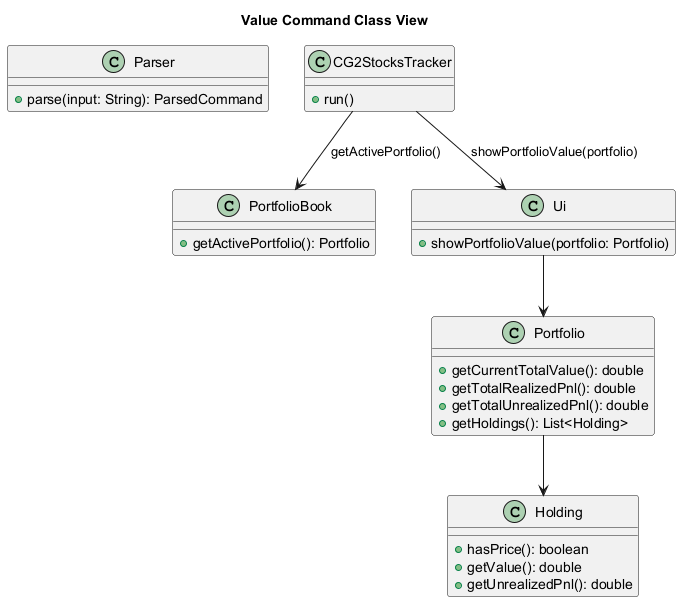
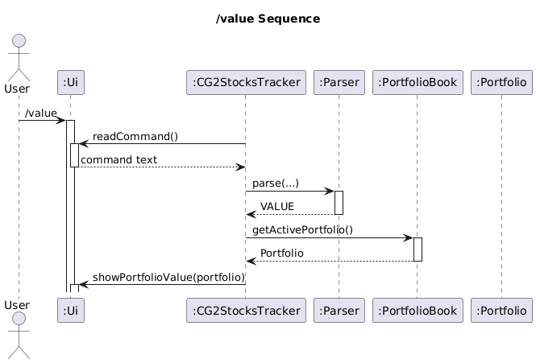

### Error handling and validation

- No active portfolio selected.

### Alternatives considered

- Move all formatting into model.
- Rejected: presentation belongs in UI layer.

### Current limitations

- No currency conversion support.

### Possible future improvements

- Add multi-currency valuation support.

## `/insights` - Performance Insights

### High-level design

Provides holding-level performance analysis with option variants in one command section.

Variants within command:

- base `/insights`
- type filter: `--type stock|etf|bond`
- top gainers: `--top N`
- chart view: `--chart`
- combinations of valid options

### Component-level implementation

- Parsing: `Parser.parseInsights(...)` stores raw option text.
- Option interpretation: `CG2StocksTracker.parseInsightsOptions(...)` validates and converts options.
- Rendering: `Ui.showInsightsTable(portfolio, filterType, topN, showChart)`.

### Class responsibilities

- `CG2StocksTracker`: option semantics and validation.
- `Ui`: filtering, sorting, summary and optional chart rendering.
- `Holding`: unrealized value source.

### Command execution flow

1. Parse raw insights options.
2. Validate option keys and values.
3. Build `InsightsOptions` object.
4. Render insights table with optional chart.

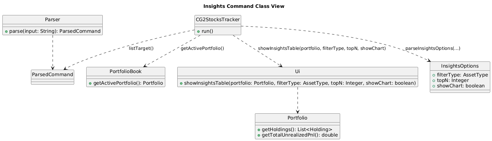
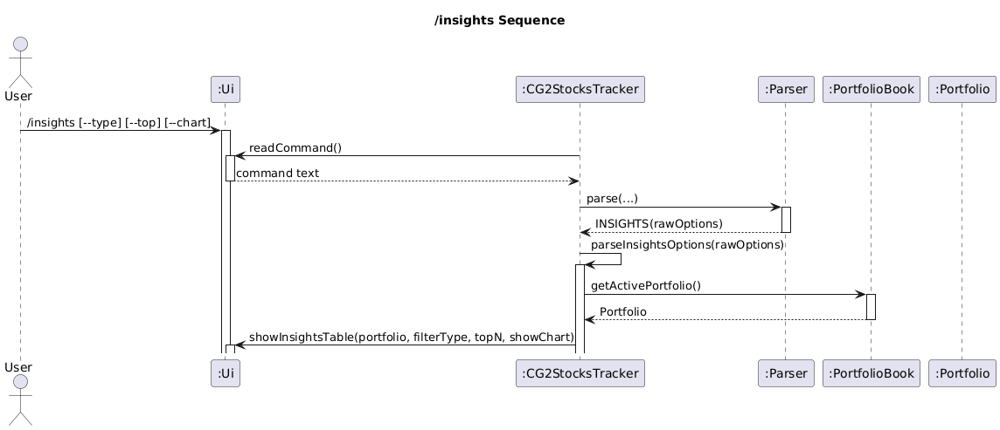

### Error handling and validation

- Duplicate options rejected.
- Missing values for `--type` and `--top` are rejected.
- Unknown options rejected.
- `--type` value must map to `AssetType`.
- `--top` must be positive integer.
- `--top` must not exceed 10,000.

### Alternatives considered

- Parse all insights options entirely in `Parser` into extra DTO fields.
- Rejected: would bloat general command DTO for one feature.

### Current limitations

- Chart is ASCII-only and not persisted.

### Possible future improvements

- Add richer export formats (CSV/JSON) for insights results.

## `/help` - Help Menu

### High-level design

Provides quick command reference.

### Component-level implementation

- Parsing: no-argument command.
- Execution: `CG2StocksTracker` calls `Ui.showHelp()`.

### Class responsibilities

- `Ui`: help content formatting.

### Command execution flow

1. Parse `/help`.
2. Print help summary.

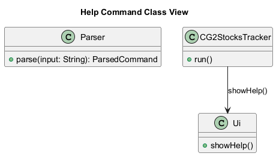
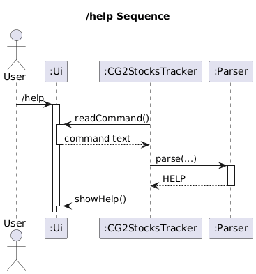

### Error handling and validation

- Extra arguments are rejected by parser.

### Alternatives considered

- External help file loading.
- Rejected for now to keep runtime dependency-free.

### Current limitations

- Help text is static and must be updated manually.

### Possible future improvements

- Generate help content from command metadata.

## `/exit` - Exit Application

### High-level design

Terminates main loop cleanly.

### Component-level implementation

- Parsing: no-argument command.
- Execution: `CG2StocksTracker.execute(...)` returns `false` for `EXIT`.
- UI shows goodbye message.

### Class responsibilities

- `CG2StocksTracker`: loop termination decision.
- `Ui`: farewell output.

### Command execution flow

1. Parse `/exit`.
2. Print goodbye.
3. Stop run loop.

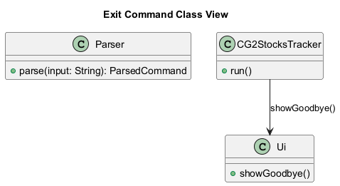
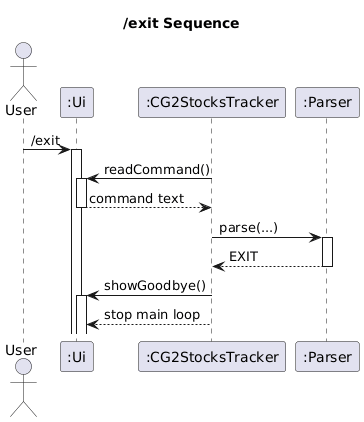

### Error handling and validation

- Extra arguments are rejected by parser.

### Alternatives considered

- Implicit EOF-only shutdown.
- Rejected: explicit command improves usability and automation.

### Current limitations

- No confirmation prompt before exit.

### Possible future improvements

- Optional unsaved-state warning mode.

## Storage Design Notes

### High-level design

Persistence uses text files for simplicity and transparency.

Main records in `data/CG2StocksTracker.txt`:

- `ACTIVE|...`
- `PORTFOLIO|...`
- `HOLDING|...`

Watchlist records in `data/CG2StocksTracker.txt.watchlist`:

- `WATCH|...`

### Error handling and validation

- Corrupted main storage lines -> `Corrupted storage file.`
- Corrupted watchlist lines -> `Corrupted watchlist storage file.`
- IO failures produce operation-specific read/write errors.

### Current limitations

- File format is tightly coupled to parser/model assumptions.

### Possible future improvements

- Move to structured JSON schema with version migration.

## User Stories

| Version | Role | Feature | Benefit | Category |
|---|---|---|---|---|
| 1.0 | Amateur investor | create a new portfolio from the CLI | separate long-term investing from short-term trades | Core portfolio management |
| 1.0 | Investor | add a stock, ETF, or bond to my portfolio via the CLI | track what I own without using spreadsheets | Core portfolio management |
| 1.0 | Investor | remove a holding from my portfolio | keep records accurate when I exit a position | Core portfolio management |
| 1.0 | Investor | view a list of all my current holdings | quickly see what my portfolio consists of | Portfolio view |
| 1.0 | Investor | update prices for my holdings | reflect current market conditions | Market data |
| 2.0 | Investor | record units/shares and average buy price | calculate gains and losses correctly | Core portfolio management |
| 2.0 | Investor | record fees (brokerage, FX, platform fees) per trade | reflect true returns | Performance accuracy |
| 2.0 | Investor | add multiple buys/sells for the same ticker | update cost basis over time | Trade tracking |
| 2.0 | Investor | view holdings grouped by asset type | understand allocation quickly | Portfolio view |
| 2.0 | Investor | see the current total value of my portfolio | know what my investments are worth right now | Portfolio value |
| 2.0 | Investor | see gains or losses per holding | know which assets help or hurt performance | Performance insights |
| 2.0 | Investor | see unrealized vs realized gains separately | distinguish paper gains from locked-in results | Performance insights |
| 2.0 | Amateur investor | add a stock to a watchlist even if I do not own it | track opportunities over time | Watchlist |
| 2.0 | Investor | view my watchlist separately from my portfolio | avoid mixing owned vs considered assets | Watchlist |

## Non-Functional Requirements

- Platform support: the product must run on Java 17 or above on Windows, macOS, and Linux.
- Reliability: invalid or malformed user input must not terminate the application; after an error, the app must display an error message and continue accepting the next command.
- Persistence: after any successful state-changing command, the resulting portfolio and watchlist data must still be present after the application is closed and started again.
- Usability: when a command is rejected due to invalid input, the error message must identify the invalid command or option and state the expected command format or constraint.
- Performance: on a typical personal dataset of up to 10 portfolios and 200 total holdings, each single command should complete and print its response within 1 second on a standard developer laptop.

## Glossary

| Term | Meaning |
|---|---|
| Portfolio | A named container of holdings (for example, `longterm`, `trading`). |
| Holding | One owned asset identified by `(assetType, ticker)`. |
| Ticker | Asset symbol used to identify holdings; normalized to uppercase and limited to 10 characters. |
| Asset type | Category of holding: `stock`, `etf`, or `bond`. |
| Quantity (QTY) | Number of units currently owned for a holding. |
| Average buy price (AVG_BUY) | Weighted average cost per unit, including buy-side fees. |
| Market price (MKT_PRICE) | Latest stored per-unit price set via `/set` or `/setmany`. |
| Current value | `quantity × market price` for a holding. |
| Realized P&L | Profit or loss from completed sells. |
| Unrealized P&L | Profit or loss on open holdings based on latest stored price. |
| Watchlist | List of assets you may buy later, optionally with target price. |
| Active portfolio | The currently selected portfolio used by most commands. |

## Instructions for Manual Testing (Smoke Checklist)

Use these as quick confidence checks after changes.

### Setup

1. Run the app.
2. Ensure `data/CG2StocksTracker.txt` and watchlist file are writable.

### Core portfolio flow

1. `/create longterm`
2. `/create trading`
3. `/use longterm`
4. `/add --type stock --ticker VOO --qty 2 --price 300 --brokerage 1`
5. `/list`
6. `/set --type stock --ticker VOO --price 350`
7. `/value`
8. `/remove --type stock --ticker VOO --qty 1 --price 360 --platform 0.5`
9. `/value`

Expected checks:

- holdings appear with updated quantity
- realized and unrealized values are shown
- no crash and no malformed output

### Watchlist flow

1. `/watch add --type etf --ticker QQQ --price 450`
2. `/watch list`
3. `/watch buy --type etf --ticker QQQ --portfolio trading`
4. `/use trading`
5. `/list`

Expected checks:

- watch item appears then is removed after buy
- one unit bought into `trading`

### Setmany flow

1. Prepare CSV file with `ticker,price` header.
2. `/setmany --file <path>`

Expected checks:

- summary shows succeeded/failed row counts
- invalid rows are reported without aborting valid rows

### Insights flow

1. `/insights`
2. `/insights --type stock`
3. `/insights --top 3 --chart`

Expected checks:

- output table is printed
- optional chart prints for `--chart`

### Failure-path spot checks

1. `/add --type crypto --ticker BTC --qty 1 --price 1`
2. `/remove --type stock --ticker UNKNOWN`
3. `/set --ticker VOO --price -1`
4. `/insights --top 0`
5. `/watch buy --type etf --ticker MISSING --portfolio trading`

Expected checks:

- each command returns clear error text
- app remains usable for next command
